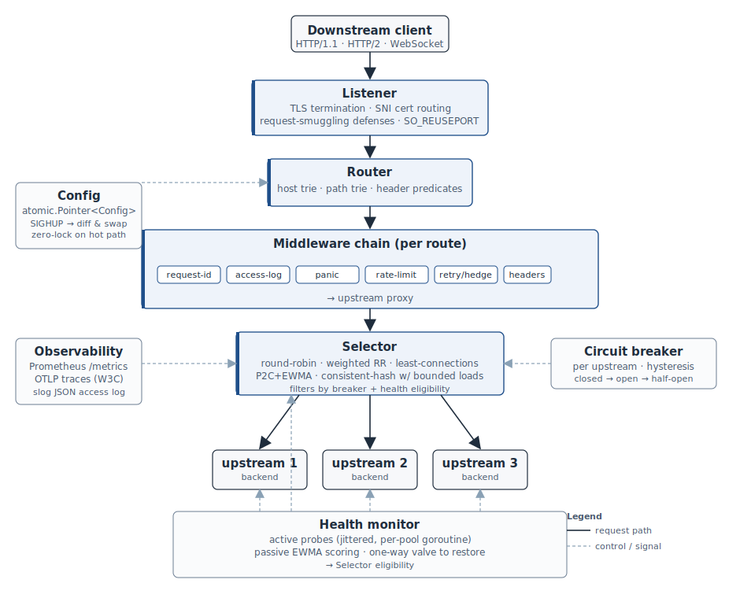

# l7rp

[](https://github.com/hmalladi3/L7rp/actions/workflows/ci.yml)

An L7 reverse proxy and load balancer written in Go.

`l7rp` is a single-binary HTTP reverse proxy built from `net/http` primitives, with the algorithmically interesting parts — load balancing, circuit breaking, retry-with-hedging, atomic configuration — implemented from scratch rather than wrapped around `httputil.ReverseProxy`.



## Status

Early. The core request lifecycle works end-to-end. Five load-balancing algorithms, the request router, the configuration manager, a seven-stage middleware chain (request-id, access-log, panic-recovery, rate-limit, retry/hedge, header-transforms, upstream-proxy), per-pool active health probes with passive EWMA failure scoring, TLS termination with SNI-based cert routing (plus optional Let's Encrypt autocert), WebSocket upgrade pass-through, HTTP request smuggling defenses, SIGHUP-triggered hot reload covering routes, pools, and listeners (via `SO_REUSEPORT`), a Prometheus metrics endpoint, and OpenTelemetry tracing with W3C `traceparent` propagation are implemented and tested under the race detector.

This is not (yet) a drop-in replacement for nginx, Caddy, or Envoy. It's a study of how those tools work internally, built with production code quality.

## Quick start

```sh
go build -o l7rp ./cmd/l7rp

cat > config.yaml <<'EOF'
listeners:
  - name: http
    bind: "127.0.0.1:8080"

upstream_pools:
  - name: backend
    selector:
      algorithm: p2c-ewma
    upstreams:
      - url: http://127.0.0.1:9001
      - url: http://127.0.0.1:9002

routes:
  - name: api
    host: localhost
    path_prefix: /
    pool: backend
EOF

./l7rp --check --config config.yaml
./l7rp --config config.yaml
```

In another terminal, with two backends running on `:9001` and `:9002`:

```sh
curl -H "Host: localhost" http://127.0.0.1:8080/anything
```

## Architecture

```
client → listener → router → middleware chain → upstream-proxy → backend
                                  │                    │             ↑
                                  └────── selector ────┤             │
                                  ┌─── circuit breaker ┘             │
                                  │                          health monitor
                                  │                          (per-pool goroutine,
                                  │                          jittered active probes)
                                  └──── metrics + slog ────→ /metrics scrape
```

Every per-request data structure is loaded once at request entry from an `atomic.Pointer[Config]`. Configuration reload allocates a new immutable `*Config`, validates it, and swaps the pointer in a single atomic store — in-flight requests finish against the snapshot they captured.

Component layout:

```
cmd/l7rp/                  entry point, runtime wiring
internal/config/           YAML schema, validation, atomic.Pointer manager
internal/router/           host + path + header trie, deterministic precedence
internal/lb/               5 selectors + circuit breaker state machine
internal/middleware/       middleware chain primitives + retry/hedge
internal/upstream/         terminal proxy: pick, dispatch, stream, report outcome
internal/listener/         TCP listener + http.Server with explicit timeouts
internal/health/           per-pool active health monitor (jittered HTTP probes)
internal/observability/    Prometheus metrics + /metrics, /-/healthz, /-/ready
```

## Load-balancing algorithms

| Algorithm | Selection logic | When to use |
|---|---|---|
| `round-robin` | counter mod N over eligible upstreams | equal-capacity backends, deterministic distribution |
| `weighted-rr` | nginx's smooth-weighted variant; interleaves rather than bursts | mixed-capacity backends |
| `least-conn` | lowest in-flight; random tie-break | request mix with widely varying durations |
| `p2c-ewma` | power-of-two-choices with EWMA latency × (1 + in-flight) scoring | **default**; resilient to slow upstreams |
| `consistent-hash-bounded` | Mirrokni-Thorup-Zadimoghaddam: walk past upstreams above ⌈(1+ε)·mean⌉ | session-affinity workloads |

### Power of two choices with EWMA latency scoring

Each `Pick` samples two distinct eligible upstreams uniformly at random and returns the one with the lower load score:

```
score(u) = latencyEWMA(u) × (1 + inflight(u))
```

The EWMA update is **time-weighted**:

```
α = 1 - exp(-Δt / half_life)
new = α · observation + (1 - α) · old
```

`Δt` is the wall-clock interval since this upstream's previous observation, so the EWMA decays in real time rather than in sample count. A common implementation mistake is to use a fixed α; that biases the score toward upstreams receiving more traffic.

### Consistent hashing with bounded loads

Standard consistent hashing admits unbounded skew when a hash range is unlucky — one shard receives a disproportionate fraction of traffic. The bounded-loads variant (published by Mirrokni, Thorup, and Zadimoghaddam at Google in 2016; deployed in production at Vimeo) caps each upstream's load at `⌈(1+ε)·mean_inflight⌉`. When the selected upstream would exceed the cap, the algorithm walks clockwise on the hash ring to the next eligible one.

This preserves session affinity for low-load keys while preventing hot-key meltdown.

## Circuit breaker

Per-(pool, upstream) state machine: `closed → open → half-open → closed`.

- **Closed.** The upstream is selectable. Each request outcome (success, 5xx, connect error, timeout) feeds into a sliding window (default: most-recent 100 requests OR 30 seconds, whichever fills first).
- **Trip condition** (closed → open). Failure ratio exceeds `failure_ratio` (default 0.5) AND the window holds at least `min_observations` (default 20). The minimum-observations floor prevents a single failure from tripping a low-traffic upstream (1/1 = 100%).
- **Open.** The upstream is filtered out of selection. Open duration starts at `open_min` (default 1s), doubles on each re-trip, capped at `open_max` (default 60s).
- **Half-open.** After the open duration elapses, the upstream is admitted for at most `half_open_probes` (default 5) selections. All success → back to closed. Any failure → back to open with doubled duration.

Cancellations (hedge canceled, client disconnect) are **not** failures. The breaker explicitly ignores them — a hedge race that one upstream "loses" must not be charged against that upstream's reliability score.

## Retry and hedge

The retry middleware buffers the request body (up to a configurable cap) and retries the chain on retryable status codes (default 502, 503, 504) and on upstream errors. Each retry attempt is threaded an `AttemptInfo` on the request context containing the list of previously-tried upstreams; the selector excludes them via the `PickHint.Exclude` mechanism.

When the route configures `hedge_after`, the middleware fires a duplicate attempt to a different upstream after the threshold elapses. Whichever response arrives first is returned to the client; the other request's context is canceled. Tail-latency improvement at modest extra load — the [Dean & Barroso "Tail at Scale"](https://research.google/pubs/the-tail-at-scale/) technique.

```yaml
middleware:
  - retry:
      max_attempts: 3
      retry_methods: ["GET", "HEAD"]
      retry_on: [502, 503, 504]
      max_replayable_body: 65536
      hedge_after: 100ms
      hedgeable: ["GET", "HEAD"]
```

## Configuration

YAML at a single path (default `/etc/l7rp/config.yaml`). Schema is documented inline in [`internal/config/config.go`](internal/config/config.go); the entrypoint reads the file once at startup. SIGHUP-based hot reload exists at the `Manager.Reload` API level but is not yet wired to the CLI.

`--check` validates the file without starting any listener:

```sh
$ l7rp --check --config config.yaml
config OK: 1 listener(s), 2 pool(s), 3 route(s)
```

Validation rejects:

- Duplicate `(host, path_prefix, header_predicates)` tuples (routing ambiguity).
- A no-predicate route placed in front of predicated routes at the same key (unreachable).
- TLS configurations with `min_version` below 1.2.
- Pools whose `passive` health is configured without `active` (passive scoring can't restore eligibility alone — would be a one-way valve).
- Health checks with `interval ≤ timeout`.
- Header transforms containing CRLF in declared values (injection vector).
- And the rest of the rules listed in `internal/config/config.go`.

## Observability

The metrics endpoint serves Prometheus text format on `127.0.0.1:9090` by default (configurable via `--metrics-bind`, set empty to disable). The endpoint is isolated from data listeners: scrape traffic can't compete with request-handling goroutines for shared bandwidth.

```sh
$ curl -s http://127.0.0.1:9090/metrics | grep ^proxy_ | head
proxy_circuit_breaker_state{pool="backend",upstream="http://10.0.0.1:8080"} 0
proxy_health_eligibility_transitions_total{pool="backend",reason="status:200",to="eligible",upstream="..."} 1
proxy_requests_total{method="GET",route="api",status="200"} 142
proxy_upstream_duration_seconds_bucket{pool="backend",upstream="...",le="0.005"} 38
proxy_upstream_inflight{pool="backend",upstream="..."} 3
proxy_upstream_requests_total{pool="backend",status="200",upstream="..."} 142
```

Label cardinality discipline: only `route`, `pool`, `upstream`, `listener`, `method`, and `status` are accepted as label values, and each comes from a bounded set known at config-load time. There is no `path`, `client_ip`, or `request_id` label — that's how Prometheus tabs blow up.

Logs are JSON via `log/slog`, written to stdout. The `--log-level` flag controls verbosity. Operators ship logs with a sidecar; the proxy does not write to files or rotate.

OpenTelemetry tracing is configured via CLI flags:

```sh
l7rp \
  --config config.yaml \
  --tracing-endpoint localhost:4317 \
  --tracing-sample-ratio 0.05 \
  --tracing-insecure
```

The proxy emits two spans per request — `proxy.request` (server-kind, at the listener boundary) and `proxy.upstream.request` (client-kind, around `Transport.RoundTrip`) — plus attribute keys `proxy.route`, `proxy.pool`, `proxy.upstream` to complement the OTel HTTP semantic conventions. W3C `traceparent` propagation is **always** active (even when export is disabled): inbound `traceparent` flows through to upstreams so the proxy never breaks a trace, regardless of whether it samples locally. Sampling is parent-based with a configurable head-based ratio for traces with no inbound decision.

## Health checking

When a pool's `health.active` block is configured, the proxy starts one goroutine per pool that probes every upstream at the configured interval. Pools are isolated — a stuck probe in one pool can't block another pool's liveness signal.

The hysteresis rules avoid flap:

- A new upstream begins **ineligible**. It needs `healthy_threshold` consecutive successful probes before traffic routes to it.
- An eligible upstream needs `unhealthy_threshold` consecutive failures to lose eligibility.
- Probes use a dedicated `http.Client` (separate from the upstream-traffic Transport), so probe traffic doesn't compete with real requests for connection slots.
- Initial probes are jittered per upstream to avoid synchronized bursts on the upstream-side probe handler.

```yaml
health:
  active:
    path: /healthz
    interval: 2s
    timeout: 1s
    healthy_threshold: 2
    unhealthy_threshold: 3
    expected_status: [200]    # optional; defaults to [200]
```

The breaker and the health flag are **independent eligibility signals** consulted by the selector. An upstream is selectable iff `eligible == true AND breaker.state != open` — so a transient burst of upstream 5xx trips the breaker (per-(pool, upstream) state machine) without invalidating the active health signal, and a probe-confirmed-down upstream stays out of rotation even if the breaker has long since reset.

Passive EWMA scoring (when configured via `health.passive`) feeds real-traffic outcomes — connection errors, timeouts, and 5xx responses — into a per-upstream EWMA with a configurable half-life (default 30s). When the error EWMA exceeds the threshold, the upstream is marked ineligible and the active-probe counters reset, so recovery requires a fresh `healthy_threshold` of consecutive probe successes. Cancellations (hedge canceled, client disconnect) are explicitly excluded from passive accounting.

## Testing

```sh
go test -race ./...                                            # unit tests
go test -tags=integration -count=1 -timeout=5m ./integration   # end-to-end
go test -bench=. -benchmem ./internal/lb                       # benchmarks
```

The unit tests cover the algorithmically interesting parts:

- **`internal/lb`** — distribution properties (P2C uniformity, CH-BL ring distribution and bounded-loads cap), EWMA time-weighting via injected clock, circuit breaker state transitions (Open → HalfOpen elapsed-time advance, doubling open durations, cancellation-not-failure invariant), race-clean concurrent picks and outcome reporting.
- **`internal/router`** — match precedence (longest exact host suffix > wildcard, longest path prefix), wildcard semantics (one label only, RFC 6125), encoded-slash non-splitting, header-predicate first-match-wins, validation rejection of ambiguous routes.
- **`internal/config`** — atomic-pointer swap under concurrent reads (race detector), in-flight snapshot survives swap, all eleven validation rules.
- **`internal/middleware`** — retry chain mechanics, body buffering up to size cap, exclude-hint propagation across attempts, hedge race timing.
- **`internal/health`** — hysteresis thresholds (healthy-after-N, unhealthy-after-M), transition callback for observability, startup posture (new pools begin ineligible).
- **`internal/observability`** — metric recording end-to-end, breaker state gauge, standard endpoints, label-cardinality safety on connection-error status.
- **`internal/listener`** — TLS configuration (modern AEAD cipher allowlist, min TLS 1.2), SNI cert routing precedence (exact → longest-wildcard → fallback), end-to-end TLS handshake against self-signed certs.

The `integration/` package builds the binary and drives it as a subprocess against real `httptest` backends. Scenarios cover: route addition via SIGHUP, listener addition via SIGHUP (exercises `SO_REUSEPORT`), pool-rebuild with breaker-state preservation, active health detection of a killed backend, circuit breaker tripping under sustained 5xx, and passive scoring ejecting a misbehaving upstream while traffic concentrates on the healthy one.

## What's implemented vs. what isn't

**In v1:**

- Load-balancing: round-robin, weighted-RR, least-connections, P2C+EWMA, consistent-hash-bounded.
- Per-(pool, upstream) circuit breaker (state machine, hysteresis, cancellation-aware).
- Host + path + header request router with deterministic precedence.
- YAML configuration with validation; `--check` mode; atomic-pointer-based runtime config swap.
- **SIGHUP-triggered hot reload** covering routes, pool definitions, and listeners. Pool changes are diffed and applied in place with per-pool monitor lifecycle and upstream-pointer preservation so circuit-breaker state survives. Listener changes use `SO_REUSEPORT` so a new socket can bind to the same `(host, port)` while the old one drains — zero observable downtime, even for bind-address rewrites.
- Seven-stage middleware chain in canonical order, per-route opt-in:
  - **request-id** — generate (or propagate) `X-Request-ID`, surface via response header and request context.
  - **access-log** — one JSON record per completed request, level chosen by status; documented stable field set.
  - **panic-recovery** — defer/recover, 500 if headers unwritten, Prometheus counter on `OnRecover`.
  - **rate-limit** — token bucket per-(scope, key); `per-ip` (with optional XFF trust hops) or `per-route`; 429 + `Retry-After`.
  - **retry/hedge** — body replay buffer, exclude-hint propagation, hedged duplicate dispatch with first-wins cancellation.
  - **header-transform** — add/remove on both directions; CRLF defense; hop-by-hop strip; `X-Forwarded-*` defaults.
  - **upstream-proxy** — terminal handler with circuit-breaker outcome reporting.
- HTTP/1.1 listener with explicit per-listener timeouts.
- **HTTP request smuggling defenses** on the listener boundary: rejects requests with both `Content-Length` and `Transfer-Encoding`, multi-valued or comma-separated `Content-Length`, and non-`chunked`/`identity` `Transfer-Encoding`.
- TLS termination with SNI-based cert routing (exact → longest-wildcard → fallback); optional **Let's Encrypt autocert** via `autocert.Manager` with `acme-tls/1` ALPN for challenge resolution; HTTP/2 via ALPN advertised.
- **WebSocket upgrade** pass-through via raw conn hijack + bidirectional `io.Copy` with half-close on either side.
- Per-pool active health probes (hysteresis thresholds + jittered initial probes) and **passive EWMA failure scoring** on real-traffic outcomes; passive can take an upstream out of rotation, only active probes can restore it (the one-way valve).
- Prometheus metrics endpoint with label-cardinality discipline; standard `/-/healthz`, `/-/ready`, `/-/version`.
- **OpenTelemetry tracing** with W3C `traceparent` propagation; OTLP/gRPC export; parent-based head sampling; `proxy.request` and `proxy.upstream.request` spans with route/pool/upstream attributes.
- Structured JSON logging via `log/slog`.
- Graceful shutdown on SIGINT/SIGTERM.

**v1.x roadmap:**

Nothing immediate. Subsequent work would be operational hardening (chaos suite, soak tests, published benchmarks) rather than feature additions.

**Explicit non-goals:**

- HTTP/3 / QUIC.
- Forward-proxy mode.
- Service-mesh features (xDS, sidecar mode).
- Caching layer.
- Web Application Firewall.
- Multi-process / cluster coordination.

## References

- Mitzenmacher, ["The Power of Two Choices in Randomized Load Balancing"](https://www.eecs.harvard.edu/~michaelm/postscripts/tpds2001.pdf), IEEE TPDS 2001.
- Mirrokni, Thorup, Zadimoghaddam, ["Consistent Hashing with Bounded Loads"](https://arxiv.org/abs/1608.01350), Google Research 2016.
- Vimeo Engineering, ["Improving load balancing with a new consistent-hashing algorithm"](https://medium.com/vimeo-engineering-blog/improving-load-balancing-with-a-new-consistent-hashing-algorithm-9f1bd75709ed).
- Dean & Barroso, ["The Tail at Scale"](https://research.google/pubs/the-tail-at-scale/), CACM 2013.

## Performance

Selector `Pick()` cost on an Apple M4 (single-thread, `go test -bench`):

| Algorithm                       | ns/op | allocs/op |
|---------------------------------|------:|----------:|
| round-robin                     |    56 |         1 |
| weighted-RR (smooth)            |    83 |         1 |
| least-connections               |    58 |         1 |
| P2C + EWMA                      |    66 |         1 |
| consistent-hash with bounded-loads | 181 |         2 |
| circuit-breaker `State()` (closed) |  4 |         0 |
| circuit-breaker `Record()` (closed) | 63 |        0 |

These are micro-benchmarks of the selector only — end-to-end request latency depends on TLS, network, upstream, and the middleware chain. Reproducible with `go test -bench=. -benchmem ./internal/lb`.

The single allocation per `Pick()` comes from the `eligibleSet` helper's release-closure; the underlying slice is recycled through `sync.Pool`. CH-BL's extra allocation comes from the per-pick eligible-lookup map; for pools small enough that this matters (≤ 16 upstreams) it's a few hundred bytes.

## Deployment

`deploy/` ships three reference layouts:

- **`deploy/Dockerfile`** — multi-stage build to a `distroless/static:nonroot` runtime. Final image is ~25 MB; no shell, no package manager, runs as UID 65532. Build with `docker build -t l7rp:dev deploy/`.
- **`deploy/systemd/l7rp.service`** — systemd unit with capability bounding (`CAP_NET_BIND_SERVICE` only), `ProtectSystem=strict`, `RestrictAddressFamilies=AF_INET AF_INET6 AF_UNIX`, and `ExecReload=/bin/kill -HUP $MAINPID` for the hot-reload path.
- **`deploy/kubernetes/deployment.yaml`** — minimal Kubernetes Deployment + Service + ConfigMap with non-root pod security context, separate startup/readiness/liveness probes against `/-/healthz` and `/-/ready`, and Prometheus scrape annotations.

These are starting points operators wrap with their own Kustomize/Helm/Terraform layers; the manifests are intentionally minimal so the wiring is legible.

## License

MIT.
